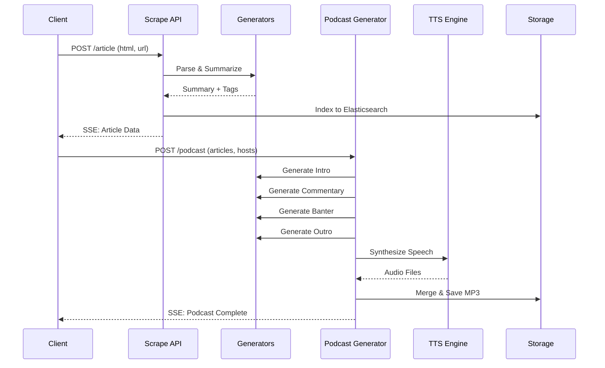

# Scribes of Alexandria

## Overview

The "Scribes of Alexandria" is a suite of AI-powered features in the OIP stack that enables:
1. **Article Scraping** - Extract and archive news articles from the web
2. **Article Summarization** - Generate AI summaries with tags
3. **Podcast Generation** - Transform groups of articles into multi-host podcast discussions
4. **Investigative Reports** - Create analytical audio reports from declassified documents

The name references the historic Library of Alexandria, with AI "scribes" (personalities based on historical figures) that discuss and analyze content.

---

## Architecture

```
┌─────────────────┐     ┌──────────────────┐     ┌─────────────────────┐
│  /api/scrape/   │────▶│  generators.js   │────▶│ Elasticsearch Index │
│    article      │     │ (summarization)  │     │   (archived posts)  │
└─────────────────┘     └──────────────────┘     └─────────────────────┘
         │
         ▼
┌─────────────────┐     ┌──────────────────────┐     ┌──────────────────┐
│ /api/generate/  │────▶│ podcast-generator.js │────▶│   Audio Files    │
│    podcast      │     │  (LLM + TTS hosts)   │     │   (MP3/WAV)      │
└─────────────────┘     └──────────────────────┘     └──────────────────┘
```

---

## API Endpoints

### 1. Article Scraping

#### `POST /api/scrape/article`
Scrapes and archives a web article, extracting metadata and generating summaries.

**Request Body:**
```json
{
  "html": "<full HTML content>",
  "url": "https://example.com/article",
  "userId": "user-identifier",
  "screenshots": [{"screenshot": "<base64>", ...}],
  "totalHeight": 3000,
  "blockchain": "arweave"
}
```

**Response:**
```json
{
  "scrapeId": "unique-scrape-id",
  "blockchain": "arweave"
}
```

**SSE Events (via `/api/scrape/stream?id={scrapeId}`):**
- `initialData` - Initial parsed article data
- `title` - Extracted title
- `byline` - Author information
- `summary` - AI-generated summary
- `dataFromIndex` - If article already exists in archive
- `finalData` - Complete processed article
- `error` - Error information

---

#### `POST /api/scrape/web-article`
Server-side article archiving (no frontend screenshots required). Requires authentication.

**Request Body:**
```json
{
  "url": "https://example.com/article",
  "blockchain": "arweave"
}
```

---

### 2. Summary Generation

#### `POST /api/generate/summary`
Generates a combined summary and podcast from multiple articles.

**Request Body:**
```json
{
  "articles": [
    {
      "url": "https://example.com/article1",
      "title": "Article Title",
      "content": "Article text content...",
      "date": "2025-01-13",
      "tags": "politics, technology"
    }
  ],
  "selectedHosts": ["socrates", "hypatia"],
  "targetLengthSeconds": 3500
}
```

**Response:**
```json
{
  "url": "/api/generate/media?id=<podcast-filename>.mp3"
}
```

---

### 3. Podcast Generation

#### `POST /api/generate/podcast`
Creates a full podcast episode from articles with AI hosts discussing the content.

**Request Body:**
```json
{
  "articles": [
    {
      "url": "https://example.com/article",
      "title": "Breaking News",
      "content": "Full article text...",
      "date": "2025-01-13",
      "tags": "tech, innovation",
      "didTx": "did:arweave:xyz123"
    }
  ],
  "selectedHosts": ["socrates", "hypatia"],
  "targetLengthSeconds": 3500
}
```

**Alternative Input (from OIP records):**
```json
{
  "didTx": "did:arweave:abc123",
  "selectedHosts": ["thomasJefferson", "machiavelli"],
  "targetLengthSeconds": 2400
}
```

Or multiple records:
```json
{
  "didTxs": ["did:arweave:abc123", "did:arweave:def456"],
  "selectedHosts": ["socrates", "hypatia"],
  "targetLengthSeconds": 3600
}
```

**SSE Events:**
- `generatingPodcast` - Generation started
- `podcastProductionUpdate` - Status updates ("Socrates is writing intro", etc.)
- `podcastComplete` - Generation finished with file path
- `error` - Error details
- `ping` - Keep-alive

---

### 4. Investigative Reports

#### `POST /api/generate/investigative-report`
Creates an audio investigative report from document analysis (e.g., JFK files).

**Request Body:**
```json
{
  "documents": [
    {
      "id": "104-10002-10343",
      "documentId": "104-10002-10343",
      "pageNumber": 1,
      "content": "Declassified document text...",
      "summary": "Brief summary",
      "names": ["Lee Harvey Oswald", "Jack Ruby"],
      "places": ["Dallas", "Dealey Plaza"],
      "dates": ["November 22, 1963"]
    }
  ],
  "metadata": {},
  "investigation": "The JFK Assassination Investigation",
  "selectedInvestigators": ["reporter", "privateEye"],
  "targetLengthSeconds": 3600
}
```

**SSE Events:**
- `generatingReport` - Started
- `investigationUpdate` - Progress updates
- `reportComplete` - Finished with file
- `error` - Error details

---

### 5. Media Serving

#### `GET /api/generate/media`
Serves generated audio files.

**Query Parameters:**
- `id` - The filename of the audio file

**Example:**
```
GET /api/generate/media?id=a1b2c3d4e5.mp3
```

---

## Available Podcast Hosts (Personalities)

Each host has unique voice settings, tone, humor style, and opening/closing lines.

| Host | Alias | Tone | Voice Provider |
|------|-------|------|----------------|
| **Socrates** | The Gadfly | Inquiring & introspective | ElevenLabs |
| **Hypatia** | The Philosopher of Light | Engaging & eloquent | ElevenLabs |
| **Thomas Jefferson** | The Sage of Monticello | Thoughtful & principled | ElevenLabs |
| **Machiavelli** | The Prince's Advisor | Sharp & strategic | ElevenLabs |
| **Leonardo da Vinci** | The Renaissance Genius | Inventive & curious | ElevenLabs |
| **Nikola Tesla** | The Master of Lightning | Intense & visionary | ElevenLabs |
| **Cleopatra** | The Queen of the Nile | Commanding & charismatic | ElevenLabs |
| **Marie Curie** | The Radium Pioneer | Analytical & inspiring | ElevenLabs |
| **Sun Tzu** | The Art of War Master | Strategic & disciplined | ElevenLabs |
| **Joan of Arc** | The Maid of Orléans | Inspirational & fervent | ElevenLabs |
| **Virginia Woolf** | The Stream of Consciousness Writer | Reflective & lyrical | ElevenLabs |
| **Ada Lovelace** | The Enchantress of Numbers | Visionary & technical | ElevenLabs |
| **Rumi** | The Mystic Poet | Mystical & poetic | ElevenLabs |
| **Marcus Aurelius** | The Philosopher King | Stoic & reflective | ElevenLabs |
| **Margaret Thatcher** | The Iron Lady | Commanding & resolute | ElevenLabs |

### Investigator Personalities

| Investigator | Alias | Tone |
|--------------|-------|------|
| **Lois Woodward** | The Story Hunter | Incisive & compelling |
| **Sam Marlowe** | The Truth Seeker | Hardboiled & analytical |

---

## LLM Prompts

### 1. Article Summary Generation

**System Prompt:**
```
You are a 160 IQ geopolitics and trivia genius tasked with generating a summary 
and tags from the provided article content and title. Use the labels SUMMARY and 
TAGS to delineate them in your response. 

For the SUMMARY, tell a story with a focus on identifying the main points, key 
information, and overall message of the article - keep it lighthearted and 
engaging, and don't start with things like 'In this article...' and 'The article 
discusses...', just jump right in, we all know why we're here. You do not ever 
abuse cliches and trite phrases like 'In a twist of...'. 

Please provide the TAGS in a comma-separated format, with primary topics first, 
followed by any secondary or related subjects.
```

**User Prompt:**
```
Here is the title and content of the article in question: | title: ${title} | 
content: ${processedContent}
```

**Model:** OpenAI GPT-4o-mini or xAI Grok-4

---

### 2. Combined Articles Summary (Podcast Script)

**System Prompt:**
```
You are a smooth talking podcaster tasked with writing a 10 minute podcast script 
that explores each of the selected articles in some amount of depth, and then 
summarizes what overlap and relationships between them. Take the dates of each 
articles into account, as well as today's date ${currentDateString}, as you 
consider your story and the context of each article. Focus on synthesizing common 
themes and important points and look for connections between the articles.
```

**User Prompt:**
```
Analyze the following dates, titles and articles and generate an entertaining 
10 minute podcast script that combines the essence of all of them. DO NOT include 
preparatory statements like "summary" or "these articles are about". Here are the 
articles: ${combinedContent}
```

**Model:** xAI Grok-4

---

### 3. Podcast Host Commentary

**System Prompt (Dynamic per host):**
```
You are ${host.name}, also known as "${host.alias}". You are the host of a 
podcast, bringing your ${host.tone} tone and ${host.humorStyle} humor style to 
the discussion. Never include stage direction or audio directions like laughs 
or pauses. Identify article titles other referenced titles by placing them 
inside quotes instead of asterisks.

${politicalPersonality} ${referenceInterests} ${conversationalInstruction} 
${referenceCave} ${flowInstruction} ${introInstruction} ${closingInstruction}
```

**Political Personality (if political content detected):**
```
You are super based, very pro America and a supporter of Donald Trump (45th 
President and 47th President-Elect of the United States) and MAGA in general, 
as well as the MAHA and DOGE elements within it. You reject all 
neoliberal/marxist ideologies and fake narratives including neoconservative 
generated narratives.
```

**User Prompts:**

*For Intro:*
```
Today's podcast will discuss: ${articleTitles}. Do not mention the article 
titles in your intro, but you sometimes briefly summarize their subjects. Set 
the stage with a compelling introduction using this introduction or something 
like it: ${openingLine}.
```

*For Article Commentary:*
```
Reflect on the following article: "${article.content}". Summarize and share a 
thoughtful commentary. ${significanceOfPassageOfTime}
```

*For Reply to Co-host:*
```
Building on the ongoing discussion (${dialogString}), your co-host said: 
"${previousComment}". Respond briefly and thoughtfully without repeating their 
points or phrases.
```

*For Outro:*
```
As we wrap up today's podcast, reflect on the discussion so far (${dialogString}). 
YOU MUST NOT REPEAT ANY PHRASES THAT HAVE ALREADY BEEN SAID. Conclude with a 
thoughtful remark and include a closing statement such as "${closingLine}".
```

**Model:** xAI Grok-4

---

### 4. Banter Generation

**System Prompt:**
```
You are creating a witty banter between ${aliasA} (${personalities[aliasA].humorStyle}) 
and ${aliasB} (${personalities[aliasB].humorStyle}). 

Avoid clichés and aim for sharp, insightful exchanges while keeping comments 
concise and engaging. Never include stage direction or audio directions like 
laughs or pauses. Identify article titles other referenced titles by placing 
them inside quotes instead of asterisks.

Use natural, conversational language based on the context: ${dialogString}. 
Alternate between them for exactly ${numLines} lines.
```

**User Prompt:**
```
${aliasA} remarked: "${commentA}". ${aliasB} replied: "${commentB}". Continue 
with alternating remarks.
```

**Model:** xAI Grok-4

---

### 5. Episode Title Generation

**System Prompt:**
```
You are an intern and you know how to make something buzz on social media. Your 
job is to give great grabby titles to our podcast episodes. They should include 
the hosts' names, ${hostNames}, and the topic of the episode, based on your own 
read through of their dialog: ${dialogString}, as well as today's date: 
${new Date().toLocaleDateString()}. Make sure to keep it short and sweet, and 
make sure it's something that would make you want to click on it.
```

---

### 6. Episode Tags Generation

**System Prompt:**
```
You are an intern and you know how to make something buzz on social media. Your 
job is to give great tags to our podcast episodes. They should include the topic 
of the episode and the various subjects discussed, based on your own read through 
of their dialog: ${dialogString}. Return a list of tags that you think would make 
this episode pop on social media, formatted as a comma separated list.
```

---

### 7. Investigative Report Prompts

**System Prompt:**
```
You are ${host.name}, investigating ${investigation} with your partner. Analyze 
these recently declassified documents with a focus on factual content and 
connections.

You are examining a subset of recently declassified documents about ${investigation} 
from a larger collection. Not every page you're given is going to be interesting 
or worth discussing, so be selective. For the ones that are, focus on providing 
direct analysis with these points (but never structure your response in a 1, 2, 3, 
4 way, just weave these points together): 

(1) What's compelling about these documents? 
(2) How do they connect to each other? 
(3) What inconsistencies do they create in regards to the official story? 
(4) How do they fit into the established historical record? 

Always support your points with direct quotes from the documents when possible, 
citing the specific page number (e.g., "On page 4, the document states..."). 
If you can't quote directly, still reference where in the document the 
information appears.

${investigativeContext} ${nameInstruction} ${reporterInvestigatorDynamics} 
${timingInstruction} ${conversationalInstruction} ${flowInstruction} 
${introInstruction} ${closingInstruction}
```

**Document Reference Instruction:**
```
When referring to specific documents, use their document ID and page number the 
first time you mention one, like "104-10002-10343, page 1", and by its page 
number, like "page 2" after that. Do not use generic terms like "document 1" 
or "the first document". These specific document IDs are essential for 
researchers to locate the exact sources being discussed.
```

---

## Show Names (Host Pairings)

The system generates unique show names based on host pairings:

| Pairing | Show Name |
|---------|-----------|
| Socrates + Hypatia | The Light of Inquiry |
| Socrates + Thomas Jefferson | The Gadfly and the Sage |
| Hypatia + Marie Curie | The Pursuit of Light |
| Thomas Jefferson + Ada Lovelace | Logic and Liberty |
| Nikola Tesla + Marie Curie | Electricity and Radiation |
| Sun Tzu + Socrates | War and Wisdom |
| ... | (100+ combinations) |

---

## Workflow: Article to Podcast



---

## Text-to-Speech Integration

### Supported TTS Providers

| Provider | Use Case | Voice Quality |
|----------|----------|---------------|
| **ElevenLabs** | Primary (podcast hosts) | High fidelity, expressive |
| **Google Cloud TTS** | Fallback | Good quality, reliable |
| **Edge TTS** | Alternative fallback | Free, decent quality |
| **Chatterbox** | Self-hosted option | Variable |

### Voice Configuration Example

```javascript
{
  google: { 
    languageCode: 'en-GB', 
    name: 'en-GB-Journey-D', 
    ssmlGender: 'MALE' 
  },
  elevenLabs: { 
    voice_id: 'NwyAvGnfbFoNNEi4UuTq',
    model_id: 'eleven_monolingual_v1',
    stability: 0.4,
    similarity_boost: 0.6
  }
}
```

---

## Published Record Structure

Generated podcasts are published to the blockchain with this structure:

```json
{
  "basic": {
    "name": "Socrates & Hypatia: AI Revolution - Jan 13, 2025",
    "language": "en",
    "date": 1736784000,
    "description": "Opening commentary...",
    "citations": ["did:arweave:abc123", "did:arweave:def456"],
    "nsfw": false,
    "tagItems": ["AI", "technology", "philosophy"]
  },
  "audio": {
    "webUrl": "https://server.com/api/media?id=podcast.mp3",
    "contentType": "audio/mp3"
  },
  "podcast": {
    "show": "The Light of Inquiry",
    "duration": 1847,
    "hosts": "[Socrates, Hypatia]"
  }
}
```

---

## Environment Variables

```bash
# LLM API Keys
OPENAI_API_KEY=sk-...
XAI_API_KEY=xai-...
XAI_BEARER_TOKEN=...

# TTS API Keys  
ELEVENLABS_API_KEY=...
GOOGLE_APPLICATION_CREDENTIALS=config/google-service-account-key.json

# Storage
MEDIA_DIR=/usr/src/app/data/media
```

---

## Error Handling

The system handles errors gracefully with SSE error events:

```javascript
res.write(`event: error\n`);
res.write(`data: ${JSON.stringify({ 
  message: 'An error occurred during podcast generation: ' + error.message 
})}\n\n`);
```

Common errors:
- Invalid host selection (falls back to defaults)
- LLM API failures (retries with fallback models)
- TTS failures (uses alternative providers)
- Missing article content (skips to next article)

---

## Related Files

| File | Purpose |
|------|---------|
| `routes/scrape.js` | Article scraping endpoints |
| `routes/generate.js` | Podcast/summary generation endpoints |
| `helpers/podcast-generator.js` | Core podcast generation logic |
| `helpers/generators.js` | LLM and TTS helper functions |
| `routes/jfk.js` | JFK/RFK document processing |
| `helpers/alfred.js` | RAG and content extraction |

---

*Last updated: January 2025*  
*Version: 1.0.0*  
*Compatible with OIP v0.8.0 and v0.9.0*
